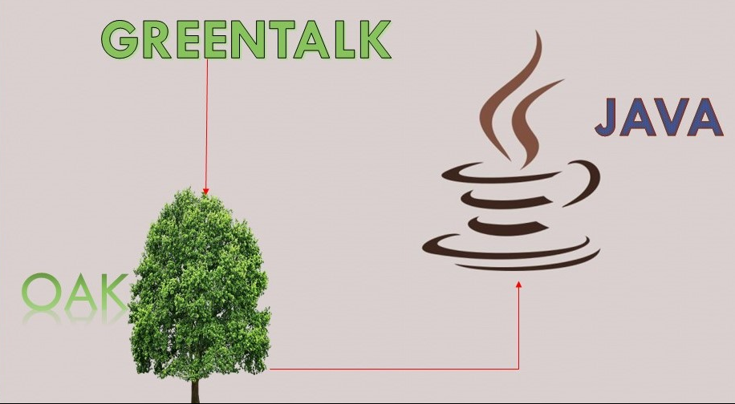
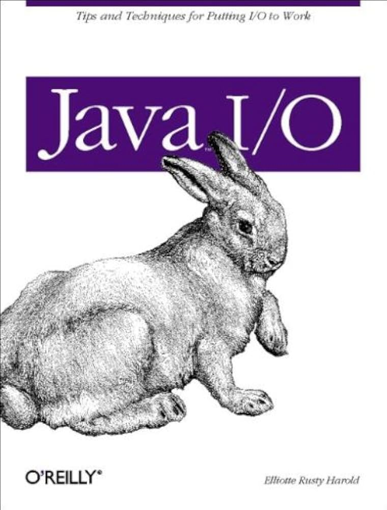
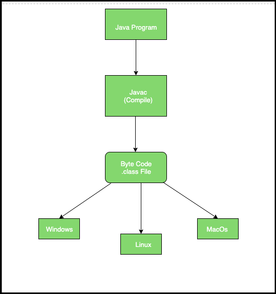
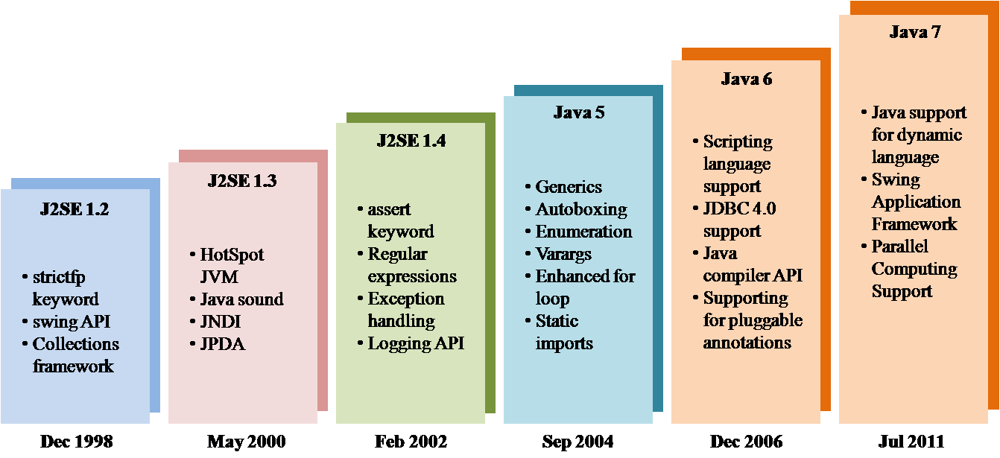
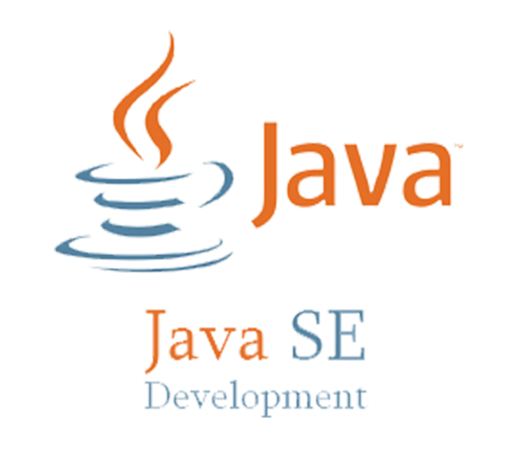
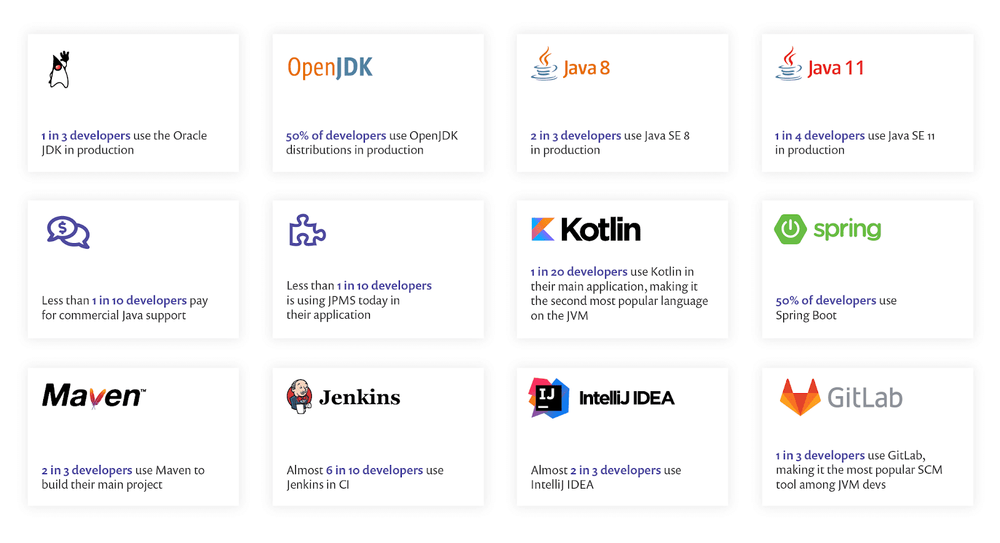

# Perjalanan Ikonik Bahasa Pemrograman: Java

Java adalah sebuah bahasa pemrograman yang berawal dari ide sederhana namun visioner. Sejak pertama kali diperkenalkan, Java telah menjadi pilar utama dalam dunia teknologi. Dari proyek kecil di Sun Microsystems hingga menjadi salah satu bahasa yang mendukung aplikasi global. Mari kita telusuri perjalanan sejarah Java dan dampaknya pada dunia pemrograman modern.

---

## Awal Mula: The Green Project (1991)

Pada tahun 1991, sebuah tim di Sun Microsystems memulai sebuah proyek ambisius yang disebut "The Green Project". Tim ini dipimpin oleh James Gosling, bersama dengan Patrick Naughton dan Mike Sheridan. Tujuan mereka sederhana: menciptakan sebuah bahasa pemrograman yang dapat digunakan di berbagai perangkat.

Awalnya, bahasa ini dinamakan "Oak", terinspirasi dari pohon oak yang ada di dekat kantor Gosling. Namun, karena masalah merek dagang, nama tersebut diubah menjadi "Java", yang berakar dari kecintaan tim terhadap kopi.

> Menarik: Nama Java mengacu pada kopi Java. Kopi adalah teman setia para pengembang dalam menjalani hari-hari mereka yang produktif.

---

## Kelahiran Resmi: Java 1.0 (1995)

    
    

Setelah melalui perjalanan panjang, Java akhirnya diluncurkan secara resmi pada tahun 1995. Java dirancang dengan filosofi "Write Once, Run Anywhere" (WORA), memungkinkan kode dapat berjalan di berbagai platform tanpa perubahan besar.

Java memiliki beberapa keunggulan utama:

- Sederhana: Lebih mudah dipelajari dibandingkan C++.
- Portabel: Berkat Java Virtual Machine (JVM), kode Java dapat berjalan di berbagai platform.
- Aman: Fitur bawaan untuk menjaga keamanan aplikasi.

Peluncuran Java 1.0 menjadi awal dari revolusi bahasa pemrograman yang fleksibel dan andal.

---

## Tonggak Penting dalam Evolusi Java

Java terus berkembang dan mencatatkan beberapa momen penting sejak peluncurannya:

1. 1996: JavaSoft dibentuk untuk mengembangkan teknologi Java lebih lanjut.
2. 1997: Pengenalan JavaBeans dan JDBC, memperluas kemampuan Java untuk aplikasi enterprise.
3. 2000: Rilis Java EE (Enterprise Edition) untuk mendukung aplikasi bisnis berukuran besar.
4. 2006: Sun Microsystems merilis Java sebagai open-source di bawah lisensi GPL.
5. 2010: Oracle mengakuisisi Sun Microsystems, membawa Java ke era baru pengembangan.

Saat ini, Java mendukung aplikasi web, mobile (termasuk Android), hingga sistem enterprise yang kompleks.

---

## Platform Java: Varian yang Dihadirkan

    

        
        
<strong>Java SE</strong>: Digunakan untuk pengembangan aplikasi desktop dan pemrograman dasar.

    

    

        
        
<strong>Java EE</strong>: Dirancang untuk aplikasi web dan sistem enterprise berskala besar.

    

    

        
        
<strong>Java ME</strong>: Mendukung perangkat mobile dan embedded dengan sumber daya terbatas.

    

---

## Komponen Utama dalam Ekosistem Java

Dalam ekosistem Java, terdapat tiga komponen utama yang saling terintegrasi:

1. JDK (Java Development Kit): Suite lengkap untuk pengembangan, termasuk compiler (`javac`), debugger, dan berbagai alat lain.
2. JRE (Java Runtime Environment): Lingkungan yang menyediakan library dan JVM untuk menjalankan aplikasi Java.
3. JVM (Java Virtual Machine): Mesin virtual yang menjalankan bytecode, mengelola memori, dan memastikan keamanan aplikasi.

---

## Mengapa Belajar Java?

Java adalah salah satu bahasa pemrograman paling populer di dunia, menawarkan banyak keuntungan:

- Portabilitas: Berkat JVM, kode Java dapat berjalan di berbagai sistem operasi.
- Keandalan: Fitur seperti garbage collection dan multithreading memberikan performa yang stabil.
- Komunitas Besar: Komunitas global pengembang Java menyediakan banyak dokumentasi dan sumber daya pembelajaran.

Java bukan hanya tentang sejarah, tetapi juga tentang relevansinya dalam teknologi masa kini dan masa depan.

---

## Apa Selanjutnya?

Jika Anda tertarik untuk mulai menggunakan Java, silakan pelajari cara menginstalnya di Arch Linux dengan panduan lengkap di dokumen [02-Setup.md](02-Setup.md).
